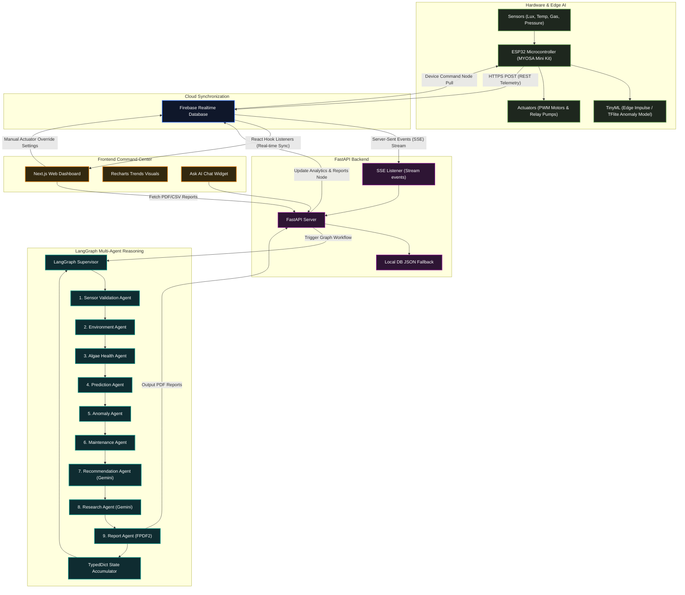

<div align="center">
  <p><a></a></p>
</div>

PublishDate: 2026-08-01

Title: **Smart BIO AIR Version 2.0:** Agentic AI-Driven Indoor Algae Based Air Purification System Using MYOSA Mini IoT Kit

An AI-powered autonomous algae bioreactor that combines Edge AI, IoT, LangGraph multi-agent reasoning, and cloud analytics to monitor biological health, predict system behaviour, automate maintenance, and improve indoor air quality.

---

## Contributors  

- **Nimalan Parameswaran** - [@nimalan-parameswaran](https://github.com/nimalan-parameswaran)  
- **Dhakshatha M K** - [@DhakshathaMylsamy](https://github.com/DhakshathaMylsamy)
  
---

## Acknowledgement 
We express our sincere gratitude to **Dr. Dinesh Chellappan**, Centre for Research and Development, for his valuable guidance, technical direction, and continuous mentorship throughout this project.

We also extend our heartfelt thanks to the **IEEE Sensors Council** for sponsoring the **MYOSA Mini IoT Kit**, which played a crucial role in enabling the development and implementation of this work.

---

<p align="center">
  
</p>

---

## Overview

**Smart BIO AIR Version 2.0** is an AI-powered autonomous algae bioreactor platform designed to improve indoor air quality while serving as an intelligent research platform for biological and environmental monitoring. The system combines living microalgae, Edge AI, IoT sensing, cloud computing, and a multi-agent artificial intelligence framework to continuously monitor environmental conditions, evaluate algae health, predict future system behaviour, and assist operators with real-time decision making.

The platform was developed as the next-generation evolution of **Smart BIO AIR Version 1**, following technical feedback received from researchers, scientists, industry professionals, and academic experts during **APSCON 2026** in New Delhi. Practical deployment of the first prototype highlighted several real-world challenges, including algae decomposition, odour generation, hardware degradation, cloud communication latency, and the absence of predictive intelligence. Version 2.0 addresses these limitations through a completely redesigned software architecture centred around autonomous AI agents and predictive analytics.

At the hardware level, the system uses the **MYOSA Mini IoT Kit (ESP32)** to acquire real-time telemetry from environmental sensors, gas sensors, motor diagnostics, and the algae cultivation chamber. Safety-critical operations such as motor control and TinyML-based fault detection continue to execute locally on the edge device, allowing uninterrupted operation even during temporary network failures.

Sensor telemetry is synchronised with the cloud through **Firebase Realtime Database**, where a **FastAPI** backend orchestrates a **LangGraph Multi-Agent AI pipeline** powered by **Google Gemini**. Rather than relying on a single AI model, the platform distributes intelligence across multiple specialised agents responsible for sensor validation, environmental analysis, algae health assessment, prediction, anomaly detection, predictive maintenance, recommendations, scientific research summarisation, and automated report generation. This modular architecture enables the system to reason about biological and operational conditions in a structured and explainable manner.

A modern **Next.js** dashboard functions as the operational command centre, presenting live telemetry, biological health indicators, predictive trend visualisations, AI-generated recommendations, maintenance schedules, active alerts, and an interactive "Ask AI" assistant for researchers and operators. The platform also generates downloadable PDF diagnostic reports and CSV telemetry datasets, supporting long-term environmental studies and experimental documentation.

To improve real-world usability, Version 2.0 introduces an activated carbon filtration stage that significantly reduces odour released from the algae chamber while maintaining biological activity. The prototype was evaluated under indoor conditions in a closed 250 sq ft room in Coimbatore over five experimental trials, demonstrating an average reduction of approximately **30% in both AQI and CO₂ concentrations within two hours**, while maintaining stable autonomous operation throughout the testing period.

Smart BIO AIR Version 2.0 is more than an indoor air purification system. It is an intelligent cyber-physical platform that combines biological engineering, Edge AI, IoT, cloud computing, Large Language Models, and multi-agent artificial intelligence to create a next-generation autonomous environmental monitoring and algae bioreactor research system. The platform is intended for applications in indoor environmental management, smart buildings, sustainable biotechnology, educational laboratories, and future AI-assisted biological research.

---
## Solution

Smart BIO AIR Version 2.0 addresses the limitations of conventional indoor air purifiers and first-generation algae-based purification systems by combining biological air treatment, Edge AI, IoT sensing, cloud computing, and Multi-Agent Artificial Intelligence into a unified autonomous platform.

The system employs **living microalgae (*Chlorella vulgaris*)** as the primary biological medium for capturing carbon dioxide and supporting natural oxygen generation. Unlike conventional filtration systems that only trap airborne pollutants, the algae bioreactor performs continuous biological treatment while simultaneously serving as a living research model for studying environmental changes and biomass growth.

At the edge layer, the **MYOSA Mini IoT Kit (ESP32)** continuously acquires telemetry from multiple environmental sensors, gas sensors, motor diagnostics, and the algae cultivation chamber. Safety-critical operations—including motor control, relay management, sensor monitoring, and TinyML-based fault detection—are executed locally on the microcontroller. This enables uninterrupted operation even during temporary internet outages and significantly reduces response latency for hardware protection.

Sensor telemetry is synchronised with the cloud through **Firebase Realtime Database**, where a **FastAPI** backend processes incoming data and coordinates a **LangGraph Multi-Agent AI framework** powered by **Google Gemini**. Instead of relying on a single AI model, the platform distributes analytical responsibilities across specialised agents responsible for:

- Sensor validation and data quality assessment
- Environmental condition analysis
- Algae health and biomass estimation
- Future state prediction
- Anomaly detection
- Predictive maintenance
- AI-generated operational recommendations
- Scientific research summarisation
- Automated report generation

This agent-based architecture enables the system to move beyond simple monitoring by continuously interpreting environmental conditions, predicting biological behaviour, detecting abnormal events before failures occur, and generating explainable recommendations for researchers and operators.

To overcome practical deployment challenges identified during Smart BIO AIR Version 1, Version 2.0 incorporates several engineering improvements. An **activated carbon filtration stage** has been integrated to minimise odour released from the algae chamber, while predictive maintenance algorithms estimate motor health, remaining useful life, and sensor calibration schedules. These enhancements increase long-term reliability and reduce manual maintenance requirements.

A modern **Next.js** web dashboard serves as the operational command centre, providing live telemetry visualisation, biological health indicators, AI-generated diagnostics, predictive analytics, actuator controls, maintenance schedules, and an interactive **Ask AI** assistant for real-time system interaction. Researchers can also generate PDF diagnostic reports and CSV telemetry datasets for long-term analysis and documentation.

By integrating biological air purification with Edge AI, TinyML, cloud-native multi-agent intelligence, predictive analytics, and real-time visualisation, Smart BIO AIR Version 2.0 evolves from a prototype air purifier into an intelligent autonomous bioreactor platform capable of supporting sustainable indoor air purification, scientific research, and future AI-assisted environmental monitoring applications.

---

## System Architecture

The Smart BIO AIR Version 2.0 platform utilizes a multi-layered cyber-physical architecture to enable real-time telemetry streaming, edge computations, cloud database synchronization, and complex agentic AI reasoning.

### Workflow & Data Flow Diagram



---

### Architectural Layers & Workflow Breakdown

#### 1. Edge & IoT Layer (ESP32 / MYOSA Mini Kit)
- **Data Collection**: The microcontroller queries environmental, gas, biological, and mechanical sensors at fixed intervals (typically every 5 seconds).
- **Edge AI (TinyML)**: Rather than pushing raw data blindly, the ESP32 passes telemetry through an **Edge Impulse TinyML model** compiled with TensorFlow Lite Micro. This model checks high-frequency fluctuations in motor vibration and current profiles locally to flag mechanical anomalies at the edge.
- **Safety Interlocks & Fail-Safes**: If communication with the cloud is lost, the local ESP32 handles core control feedback loops (e.g. shutting down pumps if water levels are depleted or activating manual flow overrides).
- **Communication Protocol**: Data is packed into JSON formats and pushed via secure REST API (HTTPS POST) calls directly into the cloud storage layer.

#### 2. Cloud Telemetry Synchronization Layer (Firebase Realtime Database)
- **Low-Latency Database**: Firebase acts as the central datastore and communication broker. It exposes real-time database paths for raw telemetry, processed analytics, agent decision logs, motor control overrides, and reports metadata.
- **Server-Sent Events (SSE)**: Raw telemetry updates in Firebase trigger instantaneous Server-Sent Events (SSE) which are streamed downstream to the FastAPI server without polling overhead.

#### 3. Processing Layer (FastAPI Backend Server)
- **Event Listeners**: A persistent asynchronous loop in the backend listens to SSE updates from Firebase.
- **Pipeline Orchestrator**: Whenever a telemetry payload is received, the backend launches the multi-agent AI pipeline.
- **API Gateways**: Hosts REST endpoints for the Next.js frontend, including:
  * `/api/telemetry`: Manual telemetry injection.
  * `/api/latest`: Fetching current metrics and consolidated reports.
  * `/api/generate-report`: Compiling daily, weekly, or scientific diagnostic reports.
  * `/api/ask-ai`: Rerouting user chat queries to Google Gemini.

#### 4. Agentic AI & Reasoning Layer (LangGraph Multi-Agent Pipeline)
Instead of processing sensor telemetry through standard conditional scripts or a single static LLM prompt, Smart BIO AIR uses a **9-agent LangGraph workflow**.
- **State Propagation**: The graph uses a centralized `GraphState` TypedDict to accumulate telemetry variables, analysis arrays, predictive trends, anomaly reports, Gemini diagnostic tips, and markdown research logs.
- **Execution Pipeline**:
  1. **Sensor Validation Agent**: Filters sensor noise and checks value bounds, assigning a **Sensor Quality Score**.
  2. **Environment Analysis Agent**: Calculates Air Quality scores, Comfort Index, stability variance, and light suitability.
  3. **Algae Health Agent**: Estimates microalgae biomass density (g/L) and calculates growth rates and biological stress metrics.
  4. **Prediction Agent**: Forecasts Green Index density, culture temperature, and water flow trends over 1-hour, 24-hour, and 7-day intervals.
  5. **Anomaly Detection Agent**: Cross-references telemetry against safety thresholds, triggering severity-based alarms.
  6. **Maintenance Agent**: Computes pump remaining useful life (RUL), projects calibration cycles, and schedules biological wash cycles.
  7. **Recommendation Agent**: Formulates context-aware troubleshooter checklists and action guides via **Google Gemini**.
  8. **Research Agent**: Drafts scientific biological logs explaining ecological relationships (e.g. photosynthesis cycles) via **Google Gemini**.
  9. **Report Agent**: Takes consolidated state variables and generates a styled PDF Diagnostic Summary using FPDF2.
- **Writeback & Sync**: Once the Report Agent finishes execution, the FastAPI backend publishes the updated analytics, warnings, and PDF reports directly back to Firebase, which synchronizes instantly with the frontend.

#### 5. Interface Layer (Next.js Dashboard Command Center)
- **Real-Time Data Display**: Next.js listens directly to Firebase paths via React hooks. The dashboard updates components dynamically—such as the biological ring (`HealthGauge.tsx`) and notifications list (`Alerts.tsx`)—whenever the database changes.
- **Interactive Controls**: Users can adjust pump speed sliders and auto/manual modes directly in the dashboard, which writes back command tokens to Firebase. These overrides are pulled instantly by the ESP32.
- **Ask AI Workspace**: Integrated Chat widgets allow operators to chat directly with Gemini regarding reactor state, sensor trends, or scientific insights.

---

## Folder Structure

```
SmartBio-AIR-v2/
├── system documentation.md         # System documentation (Agents & Dashboard)
├── backend/                        # FastAPI Python backend
│   ├── app.py                      # FastAPI entrypoint (starts listeners & simulation)
│   ├── config.py                   # App configurations & ENV loading
│   ├── local_db.json               # Auto-generated JSON database fallback
│   ├── requirements.txt            # Python requirements (LangGraph, FastAPI, FPDF2, etc.)
│   ├── test_agents.py              # Tests for LangGraph multi-agent pipeline
│   ├── agents/                     # LangGraph Multi-Agent implementation
│   │   ├── algae_agent.py          # Computes photosynthesis eff., growth rates, biomass
│   │   ├── anomaly_agent.py        # Monitors safety limit bounds & triggers active alerts
│   │   ├── environment_agent.py    # Calculates environmental stability & comfort indexes
│   │   ├── maintenance_agent.py    # Calculates pump running hours & Remaining Useful Life
│   │   ├── prediction_agent.py     # Extrapolates GI, Temp & motor life (1h, 24h, 7d)
│   │   ├── recommendation_agent.py # Invokes Gemini API for diagnostics
│   │   ├── report_agent.py         # Exports PDF summaries & telemetry CSV history sheets
│   │   ├── research_agent.py       # Compiles scientific biological summary logs
│   │   ├── sensor_agent.py         # Outlier & noise cleaner; reports Sensor Quality
│   │   └── supervisor.py           # LangGraph manager compiling the agent pipeline
│   ├── firebase/                   # Firebase DB client and listeners
│   │   ├── firebase.py             # Firebase DB client (supports REST and local modes)
│   │   └── listener.py             # SSE Database event stream listener
│   ├── llm/                        # Language model integration
│   │   ├── gemini.py               # Google Gemini client wrapper
│   │   └── prompts.py              # Prompt definitions for LLM agents
│   ├── models/                     # Data models and schemas
│   │   └── schemas.py              # Pydantic schema declarations
│   ├── reports/                    # Directory for generated PDF/CSV reports
│   ├── routes/                     # API routers
│   │   └── api.py                  # API routes (/api/latest, /api/telemetry, /api/ask-ai)
│   ├── services/                   # Business logic services
│   │   ├── alerts.py               # Alert checking logic
│   │   ├── analytics.py            # Analytics computations
│   │   └── prediction.py           # Prediction and estimation logic
│   └── utils/                      # Helper utility modules
│       ├── helper.py               # Miscellaneous helpers
│       └── logger.py               # Logger settings
├── dataset/                        # Datasets, acquisition, and preprocessing
│   ├── 1. datasets-main/           # Primary raw and processed data
│   │   ├── dataset - main.csv      # Main aggregated CSV dataset
│   │   ├── processed dataset/      # Processed data outputs
│   │   │   ├── ei_fault.csv
│   │   │   └── ei_normal.csv
│   │   └── raw data/               # Raw sensor collection dumps
│   │       ├── Fault_data.csv
│   │       ├── Normal1_data.csv
│   │       └── Normal2_data.csv
│   ├── 2. data acquisition/        # Scripts for telemetry gathering
│   │   ├── DataCollection.ino      # ESP32 code for reading and transmitting sensor readings
│   │   └── logger.py               # Python serial data logging utility
│   └── 3. data preprocessing/      # Notebooks for data transformation
│       └── Data_Preprocessing_and_EDA.ipynb # Jupyter notebook for cleaning and EDA
├── frontend/                       # Next.js React frontend application
│   ├── eslint.config.mjs           # ESLint configuration
│   ├── next.config.ts              # Next.js configurations
│   ├── package.json                # Frontend package dependencies & scripts
│   ├── tsconfig.json               # TypeScript configuration
│   ├── components/                 # Reusable React components
│   │   ├── AgentStatus.tsx         # LangGraph pipeline runtime & decisions list
│   │   ├── Alerts.tsx              # Scrolling alert logging feed
│   │   ├── ChatWindow.tsx          # Floating "Ask AI Assistant" widget
│   │   ├── Header.tsx              # System connectivity status bar
│   │   ├── HealthGauge.tsx         # Radial biological health ring & stress progress bars
│   │   ├── MotorControl.tsx        # Pump manual switches, speeds, emergency stops
│   │   ├── PredictionCharts.tsx    # Recharts trend forecaster
│   │   ├── RecommendationPanel.tsx # Gemini troubleshooter tips
│   │   ├── SensorCards.tsx         # Telemetry values grids
│   │   └── Sidebar.tsx             # Navigation bar
│   ├── pages/                      # Application route views
│   │   ├── index.tsx               # Entrypoint (Redirects to /dashboard)
│   │   ├── dashboard.tsx           # Main industrial-style analytics center
│   │   ├── reports.tsx             # PDF/CSV Report compile manager
│   │   └── settings.tsx            # Live Telemetry Injector & configuration
│   ├── services/                   # Frontend API connectors
│   │   └── api.ts                  # Frontend API fetch wrappers
│   └── styles/                     # Tailwind or global styling sheets
│       └── globals.css             # Global Tailwind/CSS rules
├── myosa_sketche/                  # Microcontroller firmware files
│   └── main.ino                    # Core ESP32 sketch for sensor readout and actuators
└── TinyML/                         # Embedded machine learning models and pipelines
    ├── README.md                   # TinyML project-specific documentation
    ├── fault diagnosis and anomaly detection/ # Exported Edge Impulse Arduino libraries
    │   ├── ei-myosa-6vdmp-fault-detection-arduino-1.0.2-TFlite.zip
    │   └── ei-myosa-6vdmp-fault-detection-arduino-1.0.3-EON.zip
    ├── src/                        # TinyML pipeline documentation assets
    └── test inference/             # Embedded testing firmware
        └── test_inference.ino      # Arduino test sketch running on-device inference
```

---

## Quick Start

### 1. Prerequisites
Ensure you have:
* Python 3.12+ installed
* Node.js v18+ and npm installed

### 2. Backend Setup
1. Open a terminal, navigate to `/backend`, and create a `.env` file:
   ```env
   GEMINI_API_KEY="your_gemini_api_key"
   FIREBASE_DATABASE_URL=https://your-project-rtdb.firebaseio.com
   FIREBASE_PROJECT_ID=your-project-id
   DATABASE_MODE=firebase # Set to 'local' to run offline without Firebase
   PORT=8000
   ```
2. Install Python dependencies:
   ```bash
   pip install -r requirements.txt
   ```
3. Launch the FastAPI server:
   ```bash
   uvicorn app:app --reload --port 8000
   ```

### 3. Frontend Setup
1. Navigate to `/frontend` folder.
2. Install Node packages:
   ```bash
   npm install
   ```
3. Run the Next.js development server:
   ```bash
   npm run dev
   ```
4. Open [http://localhost:3000](http://localhost:3000) in your browser.

---

## REST API Documentation

### Telemetry & Diagnostics
* **`GET /api/latest`**: Returns the most recent telemetry packet and calculated analytics.
* **`GET /api/history`**: Returns a list of the 50 most recent telemetry events.
* **`POST /api/telemetry`**: Inject a raw telemetry packet (used by ESP32 or the simulator).
  * Payload:
    ```json
    {
      "algae": { "green_idx": 0.8, "health": 80, "light_lux": 1500, "temp_c": 23.5 },
      "env": { "altitude": 150.0, "pressure": 1013.2 },
      "gas": { "mq135": 180, "mq2": 30, "mq3": 20, "mq7": 25 },
      "motor": { "status": "ON", "speed": 60, "flow_rate": 2.4, "operating_hours": 120 },
      "timestamp": 1785511869
    }
    ```

### AI & Reporting
* **`POST /api/ask-ai`**: Send a message to the AI agent regarding the reactor state.
* **`POST /api/generate-report`**: Trigger report compilations.
  * Parameters: `{"report_type": "daily"|"weekly"|"monthly"|"research", "format": "pdf"|"csv"}`
  * Returns: A download stream of the generated document.

### Actuator Control
* **`POST /api/manual-control`**: Modify pump speeds or trigger emergency stops.
  * Payload:
    ```json
    {
      "status": "AUTO",
      "speed": 75.0,
      "emergency_stop": false
    }
    ```
