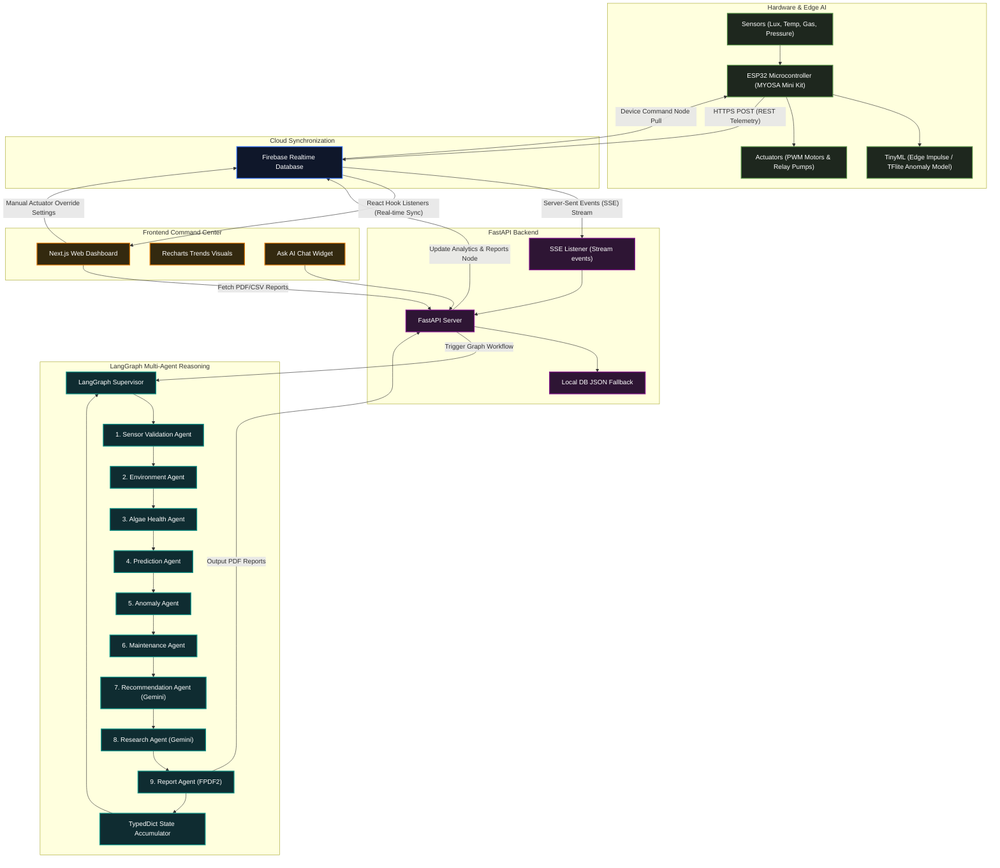

# Architectural Layers

#### 1. Edge & IoT Layer (ESP32 / MYOSA Mini Kit)
- **Data Collection**: The microcontroller queries environmental, gas, biological, and mechanical sensors at fixed intervals (typically every 5 seconds).
- **Edge AI (TinyML)**: Rather than pushing raw data blindly, the ESP32 passes telemetry through an **Edge Impulse TinyML model** compiled with TensorFlow Lite Micro. This model checks high-frequency fluctuations in motor vibration and current profiles locally to flag mechanical anomalies at the edge.
- **Safety Interlocks & Fail-Safes**: If communication with the cloud is lost, the local ESP32 handles core control feedback loops (e.g. shutting down pumps if water levels are depleted or activating manual flow overrides).
- **Communication Protocol**: Data is packed into JSON formats and pushed via secure REST API (HTTPS POST) calls directly into the cloud storage layer.

#### 2. Cloud Telemetry Synchronization Layer (Firebase Realtime Database)
- **Low-Latency Database**: Firebase acts as the central datastore and communication broker. It exposes real-time database paths for raw telemetry, processed analytics, agent decision logs, motor control overrides, and reports metadata.
- **Server-Sent Events (SSE)**: Raw telemetry updates in Firebase trigger instantaneous Server-Sent Events (SSE) which are streamed downstream to the FastAPI server without polling overhead.

#### 3. Processing Layer (FastAPI Backend Server)
- **Event Listeners**: A persistent asynchronous loop in the backend listens to SSE updates from Firebase.
- **Pipeline Orchestrator**: Whenever a telemetry payload is received, the backend launches the multi-agent AI pipeline.
- **API Gateways**: Hosts REST endpoints for the Next.js frontend, including:
  * `/api/telemetry`: Manual telemetry injection.
  * `/api/latest`: Fetching current metrics and consolidated reports.
  * `/api/generate-report`: Compiling daily, weekly, or scientific diagnostic reports.
  * `/api/ask-ai`: Rerouting user chat queries to Google Gemini.

#### 4. Agentic AI & Reasoning Layer (LangGraph Multi-Agent Pipeline)
Instead of processing sensor telemetry through standard conditional scripts or a single static LLM prompt, Smart BIO AIR uses a **9-agent LangGraph workflow**.
- **State Propagation**: The graph uses a centralized `GraphState` TypedDict to accumulate telemetry variables, analysis arrays, predictive trends, anomaly reports, Gemini diagnostic tips, and markdown research logs.
- **Execution Pipeline**:
  1. **Sensor Validation Agent**: Filters sensor noise and checks value bounds, assigning a **Sensor Quality Score**.
  2. **Environment Analysis Agent**: Calculates Air Quality scores, Comfort Index, stability variance, and light suitability.
  3. **Algae Health Agent**: Estimates microalgae biomass density (g/L) and calculates growth rates and biological stress metrics.
  4. **Prediction Agent**: Forecasts Green Index density, culture temperature, and water flow trends over 1-hour, 24-hour, and 7-day intervals.
  5. **Anomaly Detection Agent**: Cross-references telemetry against safety thresholds, triggering severity-based alarms.
  6. **Maintenance Agent**: Computes pump remaining useful life (RUL), projects calibration cycles, and schedules biological wash cycles.
  7. **Recommendation Agent**: Formulates context-aware troubleshooter checklists and action guides via **Google Gemini**.
  8. **Research Agent**: Drafts scientific biological logs explaining ecological relationships (e.g. photosynthesis cycles) via **Google Gemini**.
  9. **Report Agent**: Takes consolidated state variables and generates a styled PDF Diagnostic Summary using FPDF2.
- **Writeback & Sync**: Once the Report Agent finishes execution, the FastAPI backend publishes the updated analytics, warnings, and PDF reports directly back to Firebase, which synchronizes instantly with the frontend.

#### 5. Interface Layer (Next.js Dashboard Command Center)
- **Real-Time Data Display**: Next.js listens directly to Firebase paths via React hooks. The dashboard updates components dynamically—such as the biological ring (`HealthGauge.tsx`) and notifications list (`Alerts.tsx`)—whenever the database changes.
- **Interactive Controls**: Users can adjust pump speed sliders and auto/manual modes directly in the dashboard, which writes back command tokens to Firebase. These overrides are pulled instantly by the ESP32.
- **Ask AI Workspace**: Integrated Chat widgets allow operators to chat directly with Gemini regarding reactor state, sensor trends, or scientific insights.
