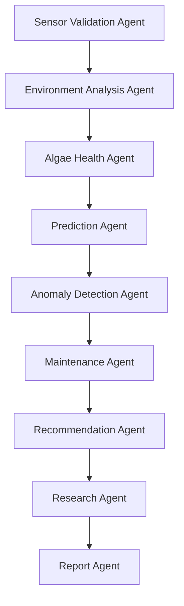

# Smart BIO AIR Version 2.0 – System Documentation

This document provides a comprehensive overview of the **Multi-Agent LangGraph AI System** and the **Next.js Dashboard Components** of the Smart BIO AIR bioreactor platform.

---

## 🤖 Multi-Agent AI System (LangGraph)

The backend is built around a multi-agent pipeline structured using **LangGraph**. When new telemetry is received or a diagnostic run is triggered, the **LangGraph Supervisor** manages a sequential workflow of 9 dedicated agents. Each agent performs a specific analytic or computational task, updating the system state as it completes.

### Agent Directory & Purposes

1. **Sensor Validation Agent (`sensor_agent.py`)**
   - **Purpose**: Acts as the entry gatekeeper for raw telemetry. It validates data fields for missing values, checks that numerical fields fall within acceptable operational bounds, clamps outlier values, and computes a **Sensor Quality Score** (percentage of valid metrics).
   - **Output**: Cleaned telemetry object and sensor quality metrics.

2. **Environment Analysis Agent (`environment_agent.py`)**
   - **Purpose**: Focuses on the room/container atmosphere. It calculates the **Environmental Stability** (from history variance of temperature and pressure), computes a room **Comfort Index**, evaluates an **Air Purification Score** (from gas sensor indexes), and checks **Photosynthesis Suitability** (judging if light and temperature ranges are healthy for algae growth).
   - **Output**: Environmental analytics metadata.

3. **Algae Health Agent (`algae_agent.py`)**
   - **Purpose**: Focuses on the biological state of the *Chlorella vulgaris* culture. It uses green index telemetry to calculate **Biomass density** (g/L), estimates the **Growth Rate** (change in green index over time), calculates a biological **Stress Index**, and compiles the ultimate **Algae Health Score** (combining stress levels and photosynthesis efficiency).
   - **Output**: Biological analytics data.

4. **Prediction Agent (`prediction_agent.py`)**
   - **Purpose**: Computes mathematical forecasting trends. It projects 1-hour, 24-hour, and 7-day estimates for critical parameters (Green Index growth, culture Temperature, and pump run cycles) using logistic biological curves and diurnal heat templates.
   - **Output**: Telemetry prediction forecasts.

5. **Anomaly Detection Agent (`anomaly_agent.py`)**
   - **Purpose**: Monitors safety limits. It checks biological and electrical metrics against pre-defined safety bounds to generate real-time `info`, `warning`, or `critical` alerts (e.g. temperature spikes, gas accumulation, flow failures, or low lux warnings).
   - **Output**: Active alarms and notification logs list.

6. **Maintenance Agent (`maintenance_agent.py`)**
   - **Purpose**: Drives predictive maintenance for hardware. It tracks total pump operating hours to compute **Motor Health %** and **Remaining Useful Life (RUL)** (based on a 5,000-hour mechanical limit), projects the next bi-weekly bioreactor cleaning cycle date, and triggers immediate calibration alerts if the sensor quality score falls below acceptable levels.
   - **Output**: Mechanical wear and schedules logs.

7. **Recommendation Agent (`recommendation_agent.py`)**
   - **Purpose**: Leverages **Google Gemini 1.5/2.0** to provide human-like diagnostic recommendations. It processes active alerts and anomalies to draft action lists, calibration guides, or override suggestions for operators.
   - **Output**: Contextual system diagnostics.

8. **Research Agent (`research_agent.py`)**
   - **Purpose**: Acts as a scientific biologist. It leverages **Google Gemini** to draft summary research logs correlating current environmental light availability, pressure cycles, gas reduction, and biomass growth rates.
   - **Output**: Deep academic/operational summary logs.

9. **Report Agent (`report_agent.py`)**
   - **Purpose**: Compiles execution summaries. It compiles a daily/weekly **PDF Diagnostic Report** (utilizing FPDF2) styled with telemetry grids, agent logs, Gemini advice, and active warnings. It also generates raw **CSV telemetry data sheets** containing chronological history.
   - **Output**: PDF files outputted to `/backend/reports/` and CSV download streams.

---

## 🖥️ Next.js Dashboard Architecture

The frontend dashboard provides a real-time command center built using React, Next.js, and TypeScript, styled using an industrial dark theme.

### Page Routes

- **Dashboard Page (`/dashboard`)**: The main operating grid showing telemetry grids, biological rings, chart predictions, and control panels.
- **Reports Page (`/reports`)**: The administrative center used to compile and export custom PDF summaries or download CSV logs.
- **Settings Page (`/settings`)**: Configures connectivity endpoints and features a mock telemetry simulator for testing offline states.

### Component Elements & Widgets

The dashboard interface is composed of the following modular elements:

| Component | Description / Functionality | UI Elements Used |
| :--- | :--- | :--- |
| **`Sidebar.tsx`** | Primary navigation panel. | Flexbox layout, system icons, and active route state highlights. |
| **`Header.tsx`** | Connectivity status monitor. | Green/red pulsing network status indicators, active API endpoint status, and database mode (local vs. Firebase) pill badges. |
| **`SensorCards.tsx`** | Live telemetry display grids. | Grid panels representing key values (Algae Temp, Lux, Green Index, Air Pressure, Gas levels, Motor stats) with micro-trend indicators. |
| **`HealthGauge.tsx`** | Biological status widget. | Large radial SVG circle representing the **Algae Health Score** (color-coded from green to red), accompanied by linear progress bars for growth velocity and culture stress. |
| **`MotorControl.tsx`** | Actuator override station. | Speed slider (0-100%), manual/auto status switches, an immediate red Emergency Stop button, and a visual remaining useful life progress bar. |
| **`Alerts.tsx`** | Real-time scrolling event logger. | Scrollable alert feed representing system notifications sorted by severity (`critical` = red, `warning` = yellow, `info` = blue). |
| **`AgentStatus.tsx`** | LangGraph pipeline visualizer. | Sidebar listing execution metrics of each agent node (speed in ms, confidence score %, latest decision description, and success status). |
| **`PredictionCharts.tsx`**| Trends and forecast simulator. | Interactive line graphs rendering 1h, 24h, and 7d predicted telemetry cycles, utilizing **Recharts**. |
| **`RecommendationPanel.tsx`**| AI Diagnostics terminal. | Text boards showing Gemini diagnostic tips and markdown-formatted academic research comments. |
| **`ChatWindow.tsx`** | "Ask AI" floating assistant. | Chat interface providing direct communication with the bioreactor LLM to run diagnostics or ask biological questions. |
